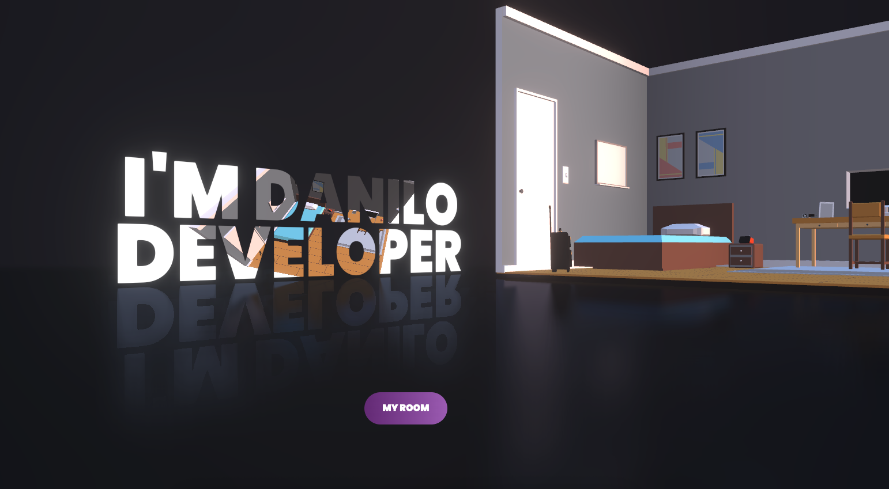

# 🚀 3D Interactive Portfolio  
A modern, performant, and cinematic portfolio built with **React Three Fiber** + **Vite** to showcase projects in an immersive 3-D space.

---



> 👀 Click, drag & scroll to explore the scene.  
> Works on desktop, tablet & mobile.

---

## ✨ Features

| Feature | Stack |
|---------|-------|
| **3-D Scene** | `react-three-fiber`, `react-three-drei` |
| **Blazing Fast Dev** | `Vite` w/ HMR |
| **Responsive UI** | `TailwindCSS` |
| **Type Safety** | `TypeScript` |
| **Linting & Formatting** | `ESLint` + `Prettier` |
| **Deployment Ready** | `GitHub Actions` → `Vercel` |

---


## 🧑‍💻 Local Dev

```bash
# 1. Clone
git clone https://github.com/danilodev6/myportfolio.git
cd myportfolio

# 2. Install
pnpm install      # or npm / yarn

# 3. Run
pnpm dev          # http://localhost:5173
